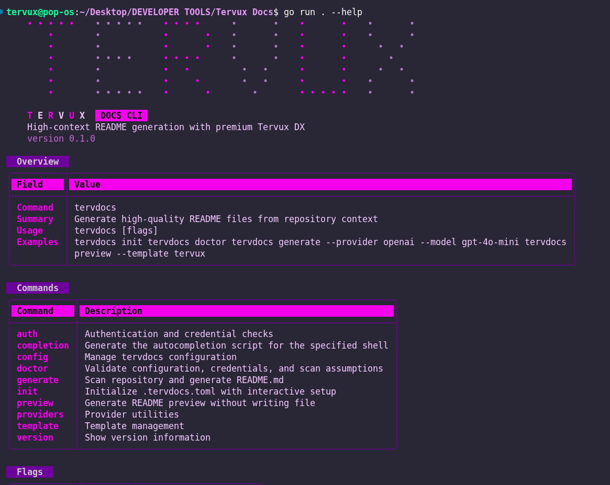
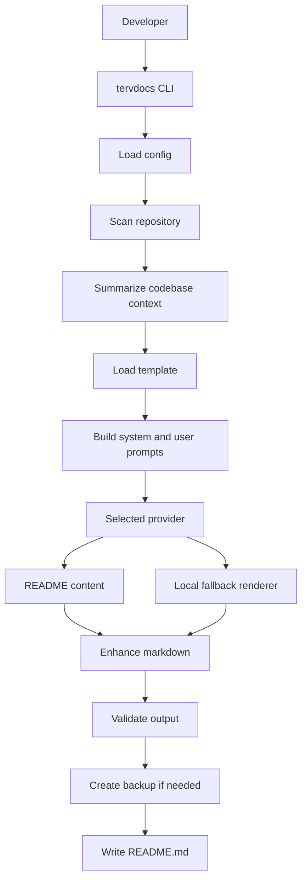

# **TervDocs**


Tervux CLI for generating grounded, branded, and developer-friendly `README.md` files from a real project scan instead of vague AI guesses.

<p align="center">
  
</p>

<div align="center" data-tervdocs-divider="true"></div>

## **Overview**

`tervdocs` is a Go CLI that scans a repository, extracts implementation signals, summarizes architecture context, builds provider prompts, and writes a polished `README.md` with Tervux-styled output. It is designed for projects that want better onboarding docs without manually rewriting repository knowledge every time the code changes.

The project combines deterministic scanning and AI-assisted generation. It also includes a local structured fallback path for unreliable free-provider runs, backup-safe output writing, provider health guidance, and a branded terminal experience built with responsive tables and a custom Tervux banner.

<div align="center" data-tervdocs-divider="true"></div>

## **Aim**

- Generate README files that stay close to the actual codebase.
- Reduce onboarding time for maintainers, teammates, and open-source users.
- Make README generation safer through previews, validation, and backups.
- Provide a premium CLI UX under the Tervux brand rather than plain terminal output.

<div align="center" data-tervdocs-divider="true"></div>

## **Problem Statement**

Most README generators fail in one of two ways:

- They are too generic and describe technologies that are not actually used in the project.
- They rely entirely on provider output, so once a model is rate-limited, slow, or noisy, the documentation quality collapses.

For a documentation tool, that creates a trust problem. The README becomes the least reliable artifact in the repository even though it should be the fastest place to understand the project.

<div align="center" data-tervdocs-divider="true"></div>

## **Solution**

`tervdocs` solves that by splitting README generation into clear stages:

1. Scan the repository and ignore noisy folders, binary assets, generated files, and pre-existing README artifacts.
2. Extract grounded signals such as language mix, dependencies, config files, tests, routes, entrypoints, folder layout, and file snippets.
3. Build a concise internal context document that captures purpose, problem, solution, setup hints, architecture hints, and key files.
4. Feed that context into a selected template and AI provider.
5. Post-process the returned markdown so required sections, SVG dividers, badges, diagrams, and developer footer are present.
6. Validate the markdown and safely write it with optional backup support.

When the shared free provider is weak or unavailable, the tool can still fall back to a local structured renderer so generation does not fully fail.

<div align="center" data-tervdocs-divider="true"></div>

## **Feature Highlights**

- Cobra-based CLI with `init`, `generate`, `preview`, `doctor`, `providers`, `auth`, `config`, `template`, and `version`.
- Repository scanner that detects languages, frameworks, routes, tests, environment files, CI workflows, and config files.
- Snippet capture from important files so prompts are grounded in actual code instead of directory names only.
- Template system with `default`, `minimal`, `detailed`, and `tervux` modes.
- Provider abstraction for `free`, `openai`, `gemini`, and `claude`.
- Local structured fallback when the shared free provider is rate-limited or unavailable.
- README enhancement layer that injects badges, SVG section dividers, diagrams, and `Programmed by ...` footer text.
- Output validation, dry-run mode, preview mode, and timestamped backups before overwrite.
- Tervux-branded help menus and responsive terminal tables for a polished CLI experience.

<div align="center" data-tervdocs-divider="true"></div>

## **Tech Stack**

| Layer | Tools |
| --- | --- |
| Language | Go |
| CLI | Cobra |
| Config | Viper, TOML |
| Interactive setup | Survey |
| Terminal UX | Lipgloss, Spinner |
| Providers | Z.AI-compatible free provider, OpenAI, Gemini, Claude |
| Output | Markdown validation, backup writer |
| Testing | `go test ./...` |

<div align="center" data-tervdocs-divider="true"></div>

## **Installation**

```bash
git clone https://github.com/JonniTech/TervDocs.git
cd TervDocs
go mod tidy
go test ./...
```

To inspect the CLI after install:

```bash
go run . --help
go run . version
go run . providers list
```

<div align="center" data-tervdocs-divider="true"></div>

## **Quick Start**

```bash
go run . init
go run . doctor
go run . preview
go run . generate
```

Recommended first-run path:

1. Initialize `.tervdocs.toml`.
2. Review provider setup with `doctor` and `auth test`.
3. Preview the markdown before writing.
4. Generate the final `README.md` with backup enabled.

<div align="center" data-tervdocs-divider="true"></div>

## **Default Profile**

The project ships with these code-level defaults in `internal/config/config.go`:

```toml
provider = "free"
model = "glm-4.7-flash"
template = "default"
temperature = 0.2
timeout = 60

[output]
file = "README.md"
backup = true

[scan]
max_files = 200
max_bytes_per_file = 50000
```

Default scan excludes include common noise sources such as `.git`, `node_modules`, `dist`, `build`, `vendor`, `coverage`, `.next`, `.turbo`, `.idea`, `.vscode`, `.qoder`, and `.codex`.

Any local `.tervdocs.toml` file can override these defaults for a specific repository.

<div align="center" data-tervdocs-divider="true"></div>


## ****Command Reference****

| Command | Purpose |
| --- | --- |
| `tervdocs init` | Create or refresh `.tervdocs.toml` through an interactive setup flow |
| `tervdocs generate` | Scan the repository and write `README.md` |
| `tervdocs generate --dry-run` | Build output without writing the file |
| `tervdocs preview` | Show generated markdown in the terminal without writing |
| `tervdocs doctor` | Validate config, provider readiness, and scan assumptions |
| `tervdocs auth test` | Verify provider config and credentials |
| `tervdocs config show` | Inspect resolved config values |
| `tervdocs config set <key> <value>` | Update a supported config key |
| `tervdocs template list` | Show built-in README templates |
| `tervdocs template use <name>` | Switch templates quickly |
| `tervdocs providers list` | View provider models, auth expectations, and recommendations |
| `tervdocs version` | Show CLI version and brand metadata |

<div align="center" data-tervdocs-divider="true"></div>

## **Generation Flow**



<div align="center" data-tervdocs-divider="true"></div>

## **Architecture Notes**

- `main.go` starts the CLI and delegates all execution to `cmd.Execute()`.
- `cmd/` owns the command layer, argument overrides, provider advisories, and summary tables.
- `internal/app` wires the container and exposes the generator service.
- `internal/generate` orchestrates scan, summarize, prompt, provider execution, fallback, render, and output write.
- `internal/scan` is responsible for repo walking, ignore logic, dependency detection, route hints, and snippet capture.
- `internal/summarize` converts raw scan data into documentation-ready context.
- `internal/providers` isolates model-specific clients and shared provider contracts.
- `internal/render` upgrades raw markdown with badges, required sections, diagrams, SVG dividers, and developer footer.
- `internal/output` validates markdown and handles safe writes plus backups.
- `internal/cli` owns the Tervux-branded terminal UX.

<div align="center" data-tervdocs-divider="true"></div>

## **Project Structure**

```text
.
├── assets/
│   └── sample-terminal.png
├── cmd/
│   ├── auth.go
│   ├── config.go
│   ├── doctor.go
│   ├── generate.go
│   ├── init.go
│   ├── preview.go
│   ├── providers.go
│   ├── provider_notice.go
│   ├── template.go
│   └── version.go
├── internal/
│   ├── app/
│   ├── backup/
│   ├── cli/
│   ├── config/
│   ├── doctor/
│   ├── generate/
│   ├── output/
│   ├── prompt/
│   ├── providers/
│   ├── render/
│   ├── scan/
│   ├── summarize/
│   └── util/
├── main.go
├── go.mod
└── LICENSE
```

<div align="center" data-tervdocs-divider="true"></div>

## **Provider Strategy**

Out of the box, `tervdocs` supports four provider modes:

| Provider | Role |
| --- | --- |
| `free` | Shared Z.AI-compatible provider for quick access |
| `openai` | Dedicated OpenAI integration |
| `gemini` | Dedicated Gemini integration |
| `claude` | Dedicated Anthropic Claude integration |

Important notes:

- The shared free provider is convenient, but it can be rate-limited, slow, or unavailable in busy periods.
- If that happens, `tervdocs` can fall back to a local structured renderer instead of failing hard on every run.
- For the strongest README quality and reliability, use a dedicated provider with your own API key.

Expected environment variables:

- `OPENAI_API_KEY`
- `GEMINI_API_KEY`
- `ANTHROPIC_API_KEY`
- `ZAI_API_KEY` for the free-provider endpoint

<div align="center" data-tervdocs-divider="true"></div>

## **Development Workflow**

```bash
go test ./...
go run . --help
go run . config show
go run . doctor
go run . template list
go run . preview --template detailed
go run . generate --dry-run
```

If you are refining the CLI experience itself, narrow and expand the terminal while checking:

```bash
COLUMNS=60 go run . --help
COLUMNS=80 go run . providers list
COLUMNS=120 go run . --help
```

<div align="center" data-tervdocs-divider="true"></div>

## **Troubleshooting**

- If `tervdocs generate` says the config is missing, run `tervdocs init` first.
- If the free provider is slow or rate-limited, switch to `claude`, `gemini`, or `openai` for more stable output.
- If generated content feels weak, check `doctor`, inspect scan excludes, and run `preview` before writing.
- If your terminal is too narrow, some CLI views intentionally hide overflow until the window is expanded.
- If a README already exists, backup mode can preserve the older version before overwrite.

<div align="center" data-tervdocs-divider="true"></div>

## **License**

This project is released under the MIT License. See [`LICENSE`](./LICENSE) for details.

<div align="center" data-tervdocs-divider="true"></div>

<div align="center"><sub style="color:#00ADD8;">Programmed by NYAGANYA</sub></div>
