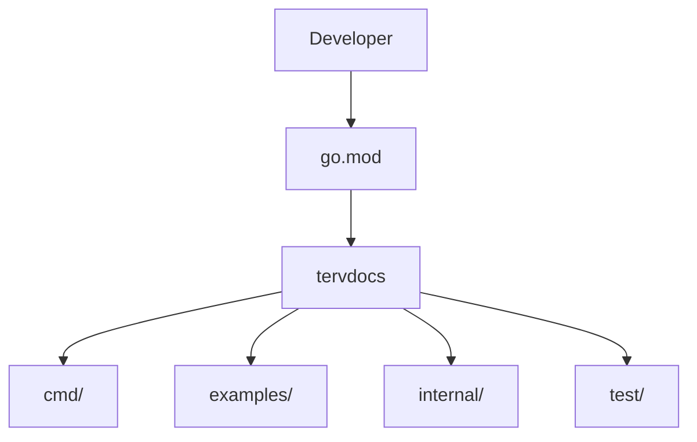

# tervdocs


     

A Go-based application with framework integrations and a structured developer workflow.

<div align="center" data-tervdocs-divider="true"><svg width="100%" height="6" viewBox="0 0 120 6" preserveAspectRatio="none" xmlns="http://www.w3.org/2000/svg" role="img" aria-label="section divider"><rect x="0" y="2.5" width="120" height="1" fill="#00ADD8" opacity="0.35"></rect><rect x="-24" y="2" width="24" height="2" rx="1" fill="#00ADD8"><animate attributeName="x" from="-24" to="144" dur="4s" repeatCount="indefinite"></animate></rect></svg></div>
## Overview

The codebase exposes clear entrypoints such as go.mod; major concerns are split across cmd, examples, internal, test.

<div align="center" data-tervdocs-divider="true"><svg width="100%" height="6" viewBox="0 0 120 6" preserveAspectRatio="none" xmlns="http://www.w3.org/2000/svg" role="img" aria-label="section divider"><rect x="0" y="2.5" width="120" height="1" fill="#00ADD8" opacity="0.35"></rect><rect x="-24" y="2" width="24" height="2" rx="1" fill="#00ADD8"><animate attributeName="x" from="-24" to="144" dur="4s" repeatCount="indefinite"></animate></rect></svg></div>
## Aim

A Go-based application with framework integrations and a structured developer workflow.

<div align="center" data-tervdocs-divider="true"><svg width="100%" height="6" viewBox="0 0 120 6" preserveAspectRatio="none" xmlns="http://www.w3.org/2000/svg" role="img" aria-label="section divider"><rect x="0" y="2.5" width="120" height="1" fill="#00ADD8" opacity="0.35"></rect><rect x="-24" y="2" width="24" height="2" rx="1" fill="#00ADD8"><animate attributeName="x" from="-24" to="144" dur="4s" repeatCount="indefinite"></animate></rect></svg></div>
## Problem

Developers and collaborators need a clear way to understand how requests move through the codebase and how the main runtime pieces fit together.

<div align="center" data-tervdocs-divider="true"><svg width="100%" height="6" viewBox="0 0 120 6" preserveAspectRatio="none" xmlns="http://www.w3.org/2000/svg" role="img" aria-label="section divider"><rect x="0" y="2.5" width="120" height="1" fill="#00ADD8" opacity="0.35"></rect><rect x="-24" y="2" width="24" height="2" rx="1" fill="#00ADD8"><animate attributeName="x" from="-24" to="144" dur="4s" repeatCount="indefinite"></animate></rect></svg></div>
## Solution

The codebase exposes clear entrypoints such as go.mod; major concerns are split across cmd, examples, internal, test.

<div align="center" data-tervdocs-divider="true"><svg width="100%" height="6" viewBox="0 0 120 6" preserveAspectRatio="none" xmlns="http://www.w3.org/2000/svg" role="img" aria-label="section divider"><rect x="0" y="2.5" width="120" height="1" fill="#00ADD8" opacity="0.35"></rect><rect x="-24" y="2" width="24" height="2" rx="1" fill="#00ADD8"><animate attributeName="x" from="-24" to="144" dur="4s" repeatCount="indefinite"></animate></rect></svg></div>
## Features

- API routes or routing files detected
- The stack includes explicit third-party dependencies and tooling
- API or routing hints detected in the codebase

<div align="center" data-tervdocs-divider="true"><svg width="100%" height="6" viewBox="0 0 120 6" preserveAspectRatio="none" xmlns="http://www.w3.org/2000/svg" role="img" aria-label="section divider"><rect x="0" y="2.5" width="120" height="1" fill="#00ADD8" opacity="0.35"></rect><rect x="-24" y="2" width="24" height="2" rx="1" fill="#00ADD8"><animate attributeName="x" from="-24" to="144" dur="4s" repeatCount="indefinite"></animate></rect></svg></div>
## Tech Stack

- Languages: Go
- Frameworks: Django, Express, Fiber, Flask, Gin
- Package manager: go modules
- Key dependencies: cobra, github.com/AlecAivazis/survey/v2, github.com/briandowns/spinner, github.com/charmbracelet/lipgloss, github.com/pelletier/go-toml/v2, github.com/spf13/cobra, github.com/spf13/viper, viper

<div align="center" data-tervdocs-divider="true"><svg width="100%" height="6" viewBox="0 0 120 6" preserveAspectRatio="none" xmlns="http://www.w3.org/2000/svg" role="img" aria-label="section divider"><rect x="0" y="2.5" width="120" height="1" fill="#00ADD8" opacity="0.35"></rect><rect x="-24" y="2" width="24" height="2" rx="1" fill="#00ADD8"><animate attributeName="x" from="-24" to="144" dur="4s" repeatCount="indefinite"></animate></rect></svg></div>
## Installation

```bash
go mod tidy
```
Primary entrypoints: go.mod

<div align="center" data-tervdocs-divider="true"><svg width="100%" height="6" viewBox="0 0 120 6" preserveAspectRatio="none" xmlns="http://www.w3.org/2000/svg" role="img" aria-label="section divider"><rect x="0" y="2.5" width="120" height="1" fill="#00ADD8" opacity="0.35"></rect><rect x="-24" y="2" width="24" height="2" rx="1" fill="#00ADD8"><animate attributeName="x" from="-24" to="144" dur="4s" repeatCount="indefinite"></animate></rect></svg></div>
## Usage

```bash
go run .
```

<div align="center" data-tervdocs-divider="true"><svg width="100%" height="6" viewBox="0 0 120 6" preserveAspectRatio="none" xmlns="http://www.w3.org/2000/svg" role="img" aria-label="section divider"><rect x="0" y="2.5" width="120" height="1" fill="#00ADD8" opacity="0.35"></rect><rect x="-24" y="2" width="24" height="2" rx="1" fill="#00ADD8"><animate attributeName="x" from="-24" to="144" dur="4s" repeatCount="indefinite"></animate></rect></svg></div>
## Flow Diagram




<div align="center" data-tervdocs-divider="true"><svg width="100%" height="6" viewBox="0 0 120 6" preserveAspectRatio="none" xmlns="http://www.w3.org/2000/svg" role="img" aria-label="section divider"><rect x="0" y="2.5" width="120" height="1" fill="#00ADD8" opacity="0.35"></rect><rect x="-24" y="2" width="24" height="2" rx="1" fill="#00ADD8"><animate attributeName="x" from="-24" to="144" dur="4s" repeatCount="indefinite"></animate></rect></svg></div>
## Architecture Notes

- CLI entry commands are organized under cmd/
- Core application logic is separated under internal/
- The repository separates command entrypoints from internal application logic
- Key implementation files include go.mod, cmd/auth.go, cmd/config.go, cmd/doctor.go

<div align="center" data-tervdocs-divider="true"><svg width="100%" height="6" viewBox="0 0 120 6" preserveAspectRatio="none" xmlns="http://www.w3.org/2000/svg" role="img" aria-label="section divider"><rect x="0" y="2.5" width="120" height="1" fill="#00ADD8" opacity="0.35"></rect><rect x="-24" y="2" width="24" height="2" rx="1" fill="#00ADD8"><animate attributeName="x" from="-24" to="144" dur="4s" repeatCount="indefinite"></animate></rect></svg></div>
## Project Structure

```text
.codex/  (1 files)
.gitignore/  (1 files)
.goreleaser.yaml/  (1 files)
GUIDE.md/  (1 files)
LICENSE/  (1 files)
cmd/  (11 files)
go.mod/  (1 files)
go.sum/  (1 files)
```


<div align="center" data-tervdocs-divider="true"><svg width="100%" height="6" viewBox="0 0 120 6" preserveAspectRatio="none" xmlns="http://www.w3.org/2000/svg" role="img" aria-label="section divider"><rect x="0" y="2.5" width="120" height="1" fill="#00ADD8" opacity="0.35"></rect><rect x="-24" y="2" width="24" height="2" rx="1" fill="#00ADD8"><animate attributeName="x" from="-24" to="144" dur="4s" repeatCount="indefinite"></animate></rect></svg></div>
## Contributing

Contributions should preserve the existing repository structure, developer workflow, and documentation quality.

<div align="center" data-tervdocs-divider="true"><svg width="100%" height="6" viewBox="0 0 120 6" preserveAspectRatio="none" xmlns="http://www.w3.org/2000/svg" role="img" aria-label="section divider"><rect x="0" y="2.5" width="120" height="1" fill="#00ADD8" opacity="0.35"></rect><rect x="-24" y="2" width="24" height="2" rx="1" fill="#00ADD8"><animate attributeName="x" from="-24" to="144" dur="4s" repeatCount="indefinite"></animate></rect></svg></div>
## License

Set the appropriate project license for distribution.
